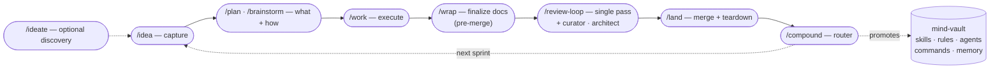

# mind-vault

> ## 👋 New here? Start with [`docs/guides/ONBOARDING.md`](docs/guides/ONBOARDING.md)
>
> Thirty-minute walkthrough from blank machine to first sprint — IDE install, Claude Code CLI + plugins, mind-vault symlinks, productive defaults, your first `/idea → /plan → /work → /wrap → /review-loop → /land → /compound` cycle.
>
> Everything below is **reference material** for engineers already past onboarding.

______________________________________________________________________

**v5 — demonstrated on a second stack (IDEA-014 Phase 2): `skills/laravel` + `skills/laravel-frontend` fill all 10 [`skills/work/references/SKILL_CONTRACT.md`](skills/work/references/SKILL_CONTRACT.md) contract headings with ZERO edits to any `agents/AGENT_*.md` — the empty `agents/` diff is the proof that the craft/stack split (v4.9, Phase 1: all 8 personas split into a craft core + `## Stack adapter`) is genuinely stack-agnostic, not Django with indirection. A real-repo Laravel dogfood follows as a v5.x fast-follow. Recent line: event-driven `/review-loop` Phase 4 — a bounded, read-only `Monitor` accelerates the `ScheduleWakeup` wait, re-entering the moment an engine verdict lands (v5.2, IDEA-021), installable as a native Claude Code plugin (`/plugin install mv@mind-vault`) alongside the symlink scripts — additive, coexist (v5.1, IDEA-017), new `skills/python` language-base tier beneath the framework skills (v4.8, IDEA-009), split `/wrap` into `/wrap` (docs) + `/land` (merge + teardown) and retire the double-review — canonical chain `/work → /wrap → /review-loop → /land` (v4.7), Claude Code Review as a third `/review-loop` engine (v4.6).**

Cross-host configuration library for AI coding agents — skills, commands, subagent personas, and shared rules, authored once and symlinked into every agent-aware tool.

> **Single source of truth.** You edit in `mind-vault/`; one setup script per host drops symlinks into each tool's native config directory. No copy-paste drift between Cursor, Claude Code, OpenCode, VS Code Copilot, or Antigravity.
>
> **v4 highlights.** The Stage 4 review surface is now engine-agnostic — opt into Cursor Bugbot, GitHub Copilot, Claude Code Review (the `claude-code-action@v1` + `code-review` plugin), any concurrent subset, or none (curator-only fallback). Canonical entry: `/review-loop <PR> bugbot`, `/review-loop <PR> copilot`, `/review-loop <PR> claude`, or any combination e.g. `/review-loop <PR> bugbot,copilot,claude`.
>
> **⚠️ `sprint-auto` is currently UNSTABLE (as of v4.4).** The overnight orchestrator hasn't been exercised end-to-end since the v3.2 integration-as-merge-gate redesign, multi-engine review, the eval-gate path, and the single-review `/wrap`+`/land` split all landed around it. Its docs were just reconciled (v4.4 sprint-auto doc-migration); the *runtime* path still needs a low-stakes shakedown batch before you trust it for unattended overnight runs. The single-IDEA flow (`/idea → /plan → /work → /wrap → /review-loop → /land`) is unaffected and stable.

## Sprint workflow — the compound loop

Mind-vault's headline value: a five-stage development loop (plus one optional discovery stage) that makes each sprint easier than the last. The final stage, `/compound`, routes every learned lesson back into mind-vault itself — extending skills, rules, and reviewer personas so the next sprint starts with a higher floor.



**Design note on the wrap/review/land finish.** The finishing sequence is **wrap → one review → land**: `/wrap` finalizes docs to shipped state → a single `/review-loop` over the wrapped PR (code + docs together) → `/land` merges. Wrap runs *before* the review (never after) so engines see docs at their merged shape — see [`skills/wrap/references/WRAP_BEFORE_REVIEW.md`](skills/wrap/references/WRAP_BEFORE_REVIEW.md). The earlier two-pass (deliverables-then-docs review) was retired in IDEA-015: `/review-loop` already iterates to clean, so one pass over the wrapped PR absorbs both finding classes. Code-only PRs make the wrap a near-no-op. Stages 1–2–3 + `/land` + `/compound` each have a dedicated skill (`/idea`, `/plan`, `/work`, `/land`, `/compound`); Stage 4 (review) is engine-selectable via the unified `/review-loop` skill: pass `bugbot`, `copilot`, `claude`, or any subset (e.g. `bugbot,copilot,claude`) as the engine argument. All engines share the same Phase 1–4 orchestrator backed by the `AGENT_curator` / `AGENT_architect` personas; engine-specific details (clean-signal parsing, retrigger semantics, Tier 1 catalogue) live in per-engine adapter references under `skills/review-loop/references/`. `claude` is push-triggered and comment-anchored rather than check-run-driven — see `skills/review-loop/references/engine-claude.md`.

See [docs/guides/SPRINT_WORKFLOW.md](docs/guides/SPRINT_WORKFLOW.md) for the full explainer — authoritative frontmatter schemas, compound-routing table, right-sizing guidance, and the handoff contract between stages.

## Structure

```text
mind-vault/
├── .claude-plugin/ CC plugin manifests (plugin.json + marketplace.json — additive install channel)
├── skills/        Agent Skills (SKILL.md + references/ + assets/ + scripts/)
├── agents/        Subagent personas (AGENT_*.md)
├── commands/      Slash commands invoked as /<name> (/mv:<name> on the plugin channel)
├── hooks/         Plugin SessionStart hook (auto-loads rules on the plugin channel)
├── rules/         Always-on behavioural rules (RULE_*.md — auto-loaded every session)
├── docs/          Specs, plans, solutions, artefacts
├── scripts/       mind-vault → host config wiring (per-host symlink setup)
├── install/       Machine provisioning (install-* helpers + install-wsl.ps1)
└── tools/         Runtime skill helpers (review-loop adapters, statusline, etc.)
```

## Skills (22)

Canonical `SKILL.md` patterns with progressive-disclosure `references/`. Each skill has frontmatter `name` + `description` (the probabilistic trigger), stays under ~500 lines, and pushes deep-dive content to `references/`.

### Sprint workflow

| Skill                         | Purpose                                                                                                                                                                                                                                                                                                                                                                                                                                                                                                                                                                                                                                                                                                                                                                                                                                                                                                                                                                                                                                                                     |
| ----------------------------- | --------------------------------------------------------------------------------------------------------------------------------------------------------------------------------------------------------------------------------------------------------------------------------------------------------------------------------------------------------------------------------------------------------------------------------------------------------------------------------------------------------------------------------------------------------------------------------------------------------------------------------------------------------------------------------------------------------------------------------------------------------------------------------------------------------------------------------------------------------------------------------------------------------------------------------------------------------------------------------------------------------------------------------------------------------------------------- |
| **ideate**                    | Stage 0 (optional) — divergent scan + adversarial filter to surface candidate improvements; promotes survivors into IDEA files via the `/idea` schema.                                                                                                                                                                                                                                                                                                                                                                                                                                                                                                                                                                                                                                                                                                                                                                                                                                                                                                                      |
| **idea**                      | Stage 1 — create or update atomic `IDEA-NNN-<slug>.md` files in `docs/ideas/`; maintains the per-priority index. Shape from a consuming project's per-idea-files split.                                                                                                                                                                                                                                                                                                                                                                                                                                                                                                                                                                                                                                                                                                                                                                                                                                                                                                                              |
| **plan**                      | Stage 2 — turn an IDEA file or rough description into a durable plan; interactive brainstorm bootstrap on thin input; `AGENT_architect` as reviewer. Aliased `/brainstorm`.                                                                                                                                                                                                                                                                                                                                                                                                                                                                                                                                                                                                                                                                                                                                                                                                                                                                                                 |
| **work**                      | Stage 3 — thin orchestrator that reads a plan, enforces `RULE_git-safety` + the parallel-worktree-docker discipline (loaded from `skills/sprint-auto/references/`), dispatches to implementation personas.                                                                                                                                                                                                                                                                                                                                                                                                                                                                                                                                                                                                                                                                                                                                                                                                                                                                  |
| **review-loop**               | Stage 4 — bounded-autonomy review-fix-rerun loop against pluggable engines (Cursor Bugbot, GitHub Copilot, Claude Code Review, or any subset); triages findings into Tier 1/2/3, batches per-cycle fixes into one commit, retriggers each engine until structurally clean (DONE + zero active findings). Engine-agnostic core; per-engine specifics in `references/engine-<name>.md`.                                                                                                                                                                                                                                                                                                                                                                                                                                                                                                                                                                                                                                                                                       |
| **wrap**                      | Stage 4.5 — documentation sweep, pre-merge. Flips IDEA frontmatter to `complete`, re-sorts the ideas index, appends a devlog/CHANGELOG entry, scans project docs for stale references (incl. the staleness-gated whole-README currency audit). `--scope`: `docs` (default) finalizes docs; `--scope=idea-only` is the sprint-auto subset; `--scope=full` is **deprecated** — it finalizes docs then redirects to `/land` (never merges). Runs **before** the single review (wrap-before-review); merge is the separate `/land` stage.                                                                                                                                                                                                                                                                                                                                                                                                                                                                                                                                       |
| **land**                      | Stage 4.7 — merge + teardown operations, after the single review clears. Atomic squash-merge on non-protected targets (protected → hand back PR URL per `RULE_git-safety`), then strictly-post-merge destructive worktree/volume teardown. Three modes: `/land NNN` pre-merge (merge → teardown), `/land NNN` post-merge (teardown only), `/land --integration <batch-iso>` (sprint-auto batch teardown). Pre-merge precondition guard refuses to merge un-wrapped work. Split out of `/wrap` in IDEA-015.                                                                                                                                                                                                                                                                                                                                                                                                                                                                                                                                                                  |
| **compound**                  | Stage 5 — **the novel piece.** Routes a post-incident learning through a hybrid Shape-C probe to one of six destinations (project-local, mind-vault skill / rule / agent pass / command, or auto-memory).                                                                                                                                                                                                                                                                                                                                                                                                                                                                                                                                                                                                                                                                                                                                                                                                                                                                   |
| **ingest-backlog**            | Brownfield-takeover helper (one-time). Atomises a monolithic `IDEAS.md` / `BACKLOG.md` / `ROADMAP.md` into per-idea files matching the sprint-workflow schema. Default dry-run.                                                                                                                                                                                                                                                                                                                                                                                                                                                                                                                                                                                                                                                                                                                                                                                                                                                                                             |
| **sprint-auto** ⚠️ *unstable* | Overnight unattended wrapper around the **full sprint workflow** (stages 2–5). Per IDEA: `/plan → /work → /wrap --scope=idea-only → /review-loop (single pass over the wrapped PR)` in per-IDEA git worktrees (pure code surfaces — **one** shared integration docker stack at port offset `+30000`, not per-IDEA stacks); `/review-loop` expands to `bugbot`, `copilot`, `claude`, or any subset per `SPRINT_AUTO_REVIEW_ENGINE`. **v3.2 integration-as-merge-gate**: per-IDEA PRs target a non-draft `[INTEGRATION]` PR (the single merge gate, left OPEN for the human); batch teardown via `/land --integration <batch-iso>`. Per-pass escalation caps 20/10/10/20/5 (single per-IDEA review / union / full / integration / compound). Belt-and-suspenders gates (`auto_safe: true` OR `auto_safe_with_eval_gate: true` + explicit arg allowlist); stops at the HITL merge boundary per `RULE_git-safety`. **Not battle-tested since v3.2 + multi-engine + eval-gate + single-review-wrap landed — shake down on a low-stakes batch first (see stability note above).** |

### Cross-project engineering

| Skill                  | Purpose                                                                                                                                                                                                                            |
| ---------------------- | ---------------------------------------------------------------------------------------------------------------------------------------------------------------------------------------------------------------------------------- |
| **python**             | Language-base tier beneath the framework skills — `ast` byte-exact flat-module→package splits, env-driven `frozenset` allowlists. Language-general recipes for any Python project; SKIP hands off to the active framework skill.   |
| **shell**              | Language-base tier beneath `deployment` + the devops persona — strict-mode hazards, quoting/input hygiene, trap cleanup + `flock` locking, plus live-host ops machinery: DRY-RUN/`--apply`/`--verify` contract with interactive precondition gates, SSH fleet sweeps, validator-less config edits with diff-shape assertions, evidence-gated remediation.                  |
| **django**             | Backend conventions: BaseModel, soft-delete, DRF viewsets, multi-tenancy boundaries, generic-FK pattern, permission probes, translation workflow.                                                                                  |
| **django-frontend**    | HTMX + Alpine + Bulma + Crispy Forms — partial dispatch, modal/formset JS contracts, safe query-string generation. Pairs with `django`.                                                                                            |
| **laravel**            | Laravel 12 backend conventions across the 6 contract concerns — Eloquent eager-loading (`with()`/`preventLazyLoading`), Form-Request + API-Resource input boundary, queued jobs on Redis/Horizon, tenant data-isolation via global scopes, Policy/Gate authz, Pest testing + split-by-ownership translations. The second stack (IDEA-014 Phase 2). |
| **laravel-frontend**   | Laravel 12 frontend conventions across the 4 contract concerns — plain server-rendered Blade baseline (+ Livewire 4 / Inertia 2 opt-in variants), `@fragment`/`->fragmentIf` partials (the django-frontend twin), Blade components (Flux as a license-gated UI kit), vanilla-JS/`wire:submit` form lock. Pairs with `laravel`. |
| **deployment**         | Docker Compose production deploys — change-aware scripts, pre/post-migration backups, screen-session remote execution, Let's Encrypt SSL.                                                                                          |
| **surgical-tdd**       | Targeted test execution for large Python monoliths (Django runner + pytest nodeids + `--lf` / `-k` / `pytest-xdist` levers).                                                                                                       |
| **artefact-retrieval** | Sweep IDE workspaces (Cursor / Antigravity / Claude Code) for plans and analyses; import into `docs/artefacts/`.                                                                                                                   |
| **dependabot-triage**  | Multi-ecosystem Dependabot PR triage — content-based dup detection across pip workspaces, risk-tier batching with per-dep commits (preserves `git bisect` post-squash-merge), live-staging smoke for SDK bumps.                    |
| **mobile-ux-polish**   | Mobile + tablet touch-interaction patterns — swipe gestures, scroll-snap panes, swipe drawers, sticky-on-scroll navbars, iOS Safari quirks (drag-vs-tap discriminator, scroll-snap settle debounce). Pairs with `django-frontend`. |

### Meta

| Skill            | Purpose                                                                                                                                                               |
| ---------------- | --------------------------------------------------------------------------------------------------------------------------------------------------------------------- |
| **skill-writer** | Authoring + refactoring `.md` skills and rules — frontmatter schema, TRIGGER/SKIP, length budget, DO/DON'T matrix, cross-project portability, emitted-template rules. |

## Agents (8 subagent personas)

`AGENT_*.md` files registered as recognized Claude Code subagents (dispatchable as `<persona>` — `architect`, `backend`, … — or `mv:<persona>` on the plugin channel) and consumed unchanged by Cursor 2.4+ (`.cursor/agents/` symlink). Each persona has Prime Directives, an N-pass workflow, a `## Stack adapter`, and a structured verdict format. Since IDEA-014 the personas are **stack-agnostic**: the craft core stays in the profile while concrete framework rules resolve against the *active* framework-stack skill via the contract-heading interface in [`skills/work/references/SKILL_CONTRACT.md`](skills/work/references/SKILL_CONTRACT.md) (stack resolved per [`skills/work/references/persona-dispatch.md`](skills/work/references/persona-dispatch.md)). Cross-harness portability — Cursor = straight copy, OpenCode + Antigravity = fork recipes — is documented in [`docs/guides/AGENT_PORTABILITY.md`](docs/guides/AGENT_PORTABILITY.md).

| Persona                                         | Covers                                                                                                                                           | Stage                                                   |
| ----------------------------------------------- | ------------------------------------------------------------------------------------------------------------------------------------------------ | ------------------------------------------------------- |
| **architect**                                   | Structural + abstraction + coupling review; author mode for cross-cutting refactors                                                              | Stage 2 reviewer (plan), Stage 3 author (cross-cutting) |
| **backend / frontend / devops / test-engineer** | Implementation personas by domain                                                                                                                | Stage 3 dispatch targets from `/work`                   |
| **curator**                                     | Pre-commit review + **sprint-end promotion sweep** mode (the review-bot personas were collapsed into `/review-loop` + engine references in v4.3) | Stage 4 reviewer + cross-sprint retrospective           |
| **documentation**                               | Docs-only authorship and review                                                                                                                  | Standalone                                              |
| **researcher**                                  | Ad-hoc investigation / literature review                                                                                                         | Standalone                                              |

## Commands

Slash commands surface from two sources via the host's symlink: `commands/` (6 commands) and `skills/` (every skill with a `name:` frontmatter is invocable as `/<name>` per the skill-writer convention). The two groups below list the **sprint-workflow** + **automation** + **review/PR** entries — the most common surfaces. Engineering-pattern skills (`python`, `shell`, `django`, `django-frontend`, `laravel`, `laravel-frontend`, `deployment`, `surgical-tdd`, `dependabot-triage`, `mobile-ux-polish`, `skill-writer`, `artefact-retrieval`) are also slash-invocable but typically activate via trigger-phrase rather than direct slash; see each skill's frontmatter.

**Sprint workflow:** `/ideate`, `/idea`, `/plan` (alias `/brainstorm`), `/work`, `/wrap`, `/land`, `/compound`, `/ingest-backlog`.

**Automation:** `/sprint-auto` — overnight unattended orchestrator for curated IDEAs, in **three phases** (the skill never merges — it stops at the HITL gate per `RULE_git-safety`):

1. **Per IDEA** (looped over each opted-in IDEA, each in its own code-surface worktree): `/plan → /work → /wrap --scope=idea-only → /review-loop` — one review pass over the wrapped PR; the per-IDEA PR targets the integration branch.
2. **Integration phase** (once, after all IDEAs): sequential-merge the per-IDEA branches onto the integration branch → batch wrap (devlog + ideas-index) → union + full test suites → `/review-loop` on the **non-draft `[INTEGRATION]` PR**. That PR is the **single merge gate** — left OPEN for the human to review + merge; merging it ships the whole batch (per-IDEA PRs auto-close as ancestors).
3. **Batch end**: `/compound` per candidate (each its own `/review-loop` on the resulting mind-vault PR). Post-merge teardown (worktrees + branches + volumes) is the human's `/land --integration <batch-iso>` chore, run after merging the `[INTEGRATION]` PR.

`/review-loop` expands to `bugbot`, `copilot`, `claude`, or any subset per `SPRINT_AUTO_REVIEW_ENGINE`. See [`skills/sprint-auto/SKILL.md`](skills/sprint-auto/SKILL.md).

**Review + PR flow:** `/review-loop` (canonical entry for all engine combinations — `bugbot`, `copilot`, `claude`, or any subset), `/create-pr`, `/test`. See `docs/guides/ONBOARDING.md` § "Pick a code-review engine" for the engine choice (bugbot / copilot / claude / curator-only); use a multi-engine list e.g. `/review-loop <PR> bugbot,copilot,claude` when more than one engine is enabled to get cycle-level synchronisation.

**Utility:** `/git-status`, `/load-rules`.

Invoke as `/<command-name>` in any host that supports slash commands. See [docs/guides/SPRINT_WORKFLOW.md](docs/guides/SPRINT_WORKFLOW.md) for the sprint-workflow orchestration story.

## Rules (always-on)

The four rules under `rules/` are auto-loaded into every session via `~/.claude/rules` symlink. They cover guardrails that apply broadly across stages — not domain-specific patterns. Domain-specific patterns that used to be rules now live as **skill references** that load on-demand when the relevant skill activates (see § Skill references below).

- **[RULE_git-safety](rules/RULE_git-safety.md)** — HITL gate on `main` and the release branch; feature branches are the agent's sandbox. Governs `/compound`'s branch policy and the review-loop's autonomous-commit permissions.
- **[RULE_self-sweep-before-push](rules/RULE_self-sweep-before-push.md)** — Pyflakes touched-files sweep + Contract-Change Sweep (grep ALL callers when a shared helper's signature/return type changes) between the review-loop's Phase 2 and Phase 3. Saves 5-10 min of review-cycle wall-time per trivial dead-import / unused-local / missed-caller finding.
- **[RULE_rename-before-drop](rules/RULE_rename-before-drop.md)** — Refactor commit-sequence discipline: rename references first, full test pass, then drop the legacy symbol, re-test for regressions. Per-commit compilability + bisectability; missed references surface during the rename-only test pass instead of hiding inside post-drop noise.
- **[RULE_cross-idea-amendments](rules/RULE_cross-idea-amendments.md)** — Shipped IDEAs are not stones — amend freely as conditions change, with bidirectional documentation between the amending and amended IDEAs. Fires at any workflow stage when downstream work needs to modify an upstream IDEA's files.

## Skill references (load on demand)

Domain-specific patterns that used to live in `rules/`. Each is loaded by its owning skill at the moment it's relevant — keeps always-on context lean.

- **[I18N_WORKFLOW](skills/django/references/I18N_WORKFLOW.md)** *(was RULE_i18n-workflow)* — Django translation map-first workflow; `.po` files are generated, never hand-edited. Per-app sharded-map ownership rule. **Loaded by:** `/work` when touching translations, `skills/django` + `skills/django-frontend`.
- **[IDEAS_LOCATION_STATUS](skills/idea/references/IDEAS_LOCATION_STATUS.md)** *(was RULE_ideas-location-status)* — IDEA files live in exactly two places: `docs/ideas/` while in backlog, `docs/archive/YYYY-MM-idea-NNN-<slug>/` thereafter. Single `git mv` at `/plan` time; all subsequent status transitions are frontmatter-only. **Loaded by:** `/idea`, `/plan`, `/work`, `/wrap`, `/compound`, `/ingest-backlog`.
- **[PARALLEL_WORKTREE_DOCKER](skills/sprint-auto/references/PARALLEL_WORKTREE_DOCKER.md)** *(was RULE_parallel-worktree-docker)* — Worktree + docker-compose isolation contract for parallel work streams (port offsets, subnet remap, MinIO bucket re-init, env-var sentinel-rewrite). **Loaded by:** `/work` (parallel plans), `/sprint-auto` (per-IDEA worktree bootstrap). Reachable from `/deployment` via its `CONTAINER_DNS_NSS.md` and `SHELL_INSTALLERS.md` references (privileged-fileops escape hatch).
- **[TENANT_SCOPED_FK_VALIDATION](skills/django/references/TENANT_SCOPED_FK_VALIDATION.md)** *(was RULE_tenant-scoped-fk-validation)* — Validate-and-prune FK helpers must scope existence checks explicitly when a model carries `org_id` (or equivalent tenant column). Schema routing alone is insufficient for shared/public-schema tables. **Loaded by:** multi-tenant Django work via `skills/django`.
- **[VISUAL_BASELINE_BUMPS](skills/django-frontend/references/VISUAL_BASELINE_BUMPS.md)** *(was RULE_visual-baseline-bumps)* — AI agents NEVER auto-`--update-snapshots`; baseline regen requires explicit human invocation. **Loaded by:** `skills/django-frontend` (Playwright work), `skills/sprint-auto` (Direction-1 IDEAs).
- **[WATCHER_HYGIENE](skills/work/references/WATCHER_HYGIENE.md)** *(was RULE_orchestrator-trash-collection)* — Explicit-stop discipline for `run_in_background` watchers (test runs, log tails, polling loops); no wall-clock timeouts; `pgrep -f` self-match avoidance. **Loaded by:** `/work`, `/sprint-auto`, `/review-loop`.

## Setup

One setup script per host. All share `_symlink-lib.sh` (DRY helpers) so behaviour is consistent. Scripts safely update existing symlinks and skip non-symlink conflicts.

```bash
# Clone (or set MIND_VAULT=/custom/path before running scripts)
cd ~/projects
git clone git@github.com:infohata/mind-vault.git
cd mind-vault

# Pick your host(s) — run as many as apply:
./scripts/setup-cursor-symlinks.sh         # Cursor 2.4+ (verified through 3.x)
./scripts/setup-claude-code-symlinks.sh    # Claude Code — CLI + IDE extensions + Desktop
./scripts/setup-opencode-symlinks.sh       # OpenCode (XDG default; OPENCODE_HOME override)
./scripts/setup-vscode-copilot-symlinks.sh # VS Code + GitHub Copilot extension
./scripts/setup-antigravity-symlinks.sh    # Google Antigravity (VS Code fork)
```

Hosts don't conflict with each other. Restart the host client after setup for it to rescan.

### Install as a Claude Code plugin (additive, CC-only)

Claude Code can install mind-vault as a **native plugin** instead of the symlink script — a single command on a fresh machine, with `/plugin` auto-update. This is **additive and CC-only**: it bundles the CC-host slice (`skills/`, `commands/`, `agents/`) under `.claude-plugin/`; the symlink path stays fully intact for machines already wired that way (pick one channel per machine — see the coexist note below).

```bash
# Private install — no public marketplace submission:
/plugin marketplace add infohata/mind-vault
/plugin install mv@mind-vault
```

Commands namespace under `mv:` on the plugin channel — type `/mv:wrap`, `/mv:idea`, etc. (coherent with the `mv-` subagent prefix). **Skill triggers are unaffected** — skills are description-invoked, so `/plan`, `/work`, `/compound` etc. still fire from natural language regardless of channel; only literal slash-typing of `commands/` entries gains the `mv:` prefix.

**Behavioural rules** (`rules/RULE_*.md`) load automatically on the plugin channel via a `SessionStart` hook (parity with the symlink channel's `~/.claude/rules/`); if anything looks unloaded, run `/mv:load-rules`.

**Dev loop — no build step.** To edit skills live from your working tree:

```bash
claude --plugin-dir ~/projects/mind-vault   # then /reload-plugins after edits
```

**Coexist note (CC only): use the plugin OR the symlink script on a single machine, not both** — running both double-loads every skill/command/agent. The symlink script prints a *best-effort, one-directional* warning if it detects an installed plugin (the reverse order and the `--plugin-dir` dev-loop are unguardable/exempt). `rules/`, `docs/rules/`, and the statusline stay **script-wired on both channels** — they have no plugin home, so the symlink script remains the way to wire them regardless.

#### Authoring vs consuming — pick the channel for the machine's *role*

`/plugin marketplace add` **git-clones the repo** into `~/.claude/plugins/marketplaces/mind-vault` and runs skills from that **pinned snapshot** — *not* from your working tree. Edits in `~/projects/mind-vault` don't go live until you `/plugin update` (which re-pulls the merged+released state from GitHub). That pinning is the whole point of the channel split — match it to what the machine *does*:

- **Consumer machine** (uses mind-vault, doesn't develop it — a project box, a VPS running overnight `sprint-auto`): **marketplace plugin.** One-command install, and `/plugin update` after each mind-vault release is the natural adoption cadence. This is the channel's home turf. **One channel-safety note for `sprint-auto` hosts:** the workflow skills' *executed* dispatches (a skill spawning a sibling skill/command/persona) must be channel-aware to resolve under the `mv:` namespace — shipped in v5.1.3+ (IDEA-020). Ensure the installed plugin is at or past that version (`/plugin update`) before running `sprint-auto` plugin-only; on a plugin pinned below it, sprint-auto's stage/persona dispatch silently fails on the plugin channel.
- **Authoring machine** (where you develop mind-vault itself): you have a **stable/dev release-channel split** for free —
  - the **pinned plugin is your stable runtime**: the agent runs a known-good mind-vault, insulated from your half-finished edits (a symlink setup can't do this — it loads WIP live the instant you save, so a broken skill-in-progress destabilizes the very tools you're working with);
  - the **working tree is the dev surface**: `/work`, `/wrap`, `/compound` operate on files + git, so you build the *next* version without needing it loaded;
  - **`/plugin update` is the promotion gate** — your compounded improvement goes live only when it's merged, released, and you deliberately pull it. The compound flywheel still turns; the floor rises per *release*, not per keystroke.
  - Prefer live skill edits while authoring (the classic symlink dev-loop)? Use **symlinks** instead, or `claude --plugin-dir ~/projects/mind-vault` to get the plugin channel *and* live loading from your working tree.

Rule of thumb: **consumer → marketplace plugin; author who wants stability → marketplace plugin (promote via `/plugin update`); author who wants live edits → symlinks or `--plugin-dir`.**

### Claude Code extra config

The `setup-claude-code-symlinks.sh` script also symlinks `~/.claude/statusline-command.sh` to the in-repo source at `tools/statusline-command.sh` — a six-segment status line showing topic / context-window % / per-turn token meter / 7-day rolling rate-limit % / thinking effort / vim mode. Runtime dependency: **`jq`** (only — token-formatting uses pure bash arithmetic, no `bc` needed). If `jq` isn't on `PATH`, the status line falls back to a single `jq missing` segment so Claude Code keeps rendering. To wire it in, add this top-level key to `~/.claude/settings.json`:

```jsonc
{
  "statusLine": {
    "type": "command",
    "command": "bash ~/.claude/statusline-command.sh"
  }
}
```

If you have a pre-existing non-symlink `statusline-command.sh` at that path, the setup script leaves it intact and prints a `(skip)` line (matching the convention used by `_symlink-lib.sh:mv_link_tree` elsewhere) — remove it manually first if you want the mind-vault version to take over.

### OpenCode extra config

Add to `~/.config/opencode/opencode.jsonc` so OpenCode auto-loads rules at session start:

```jsonc
{
  "$schema": "https://opencode.ai/config.json",
  "instructions": ["rules/RULE_*.md"]
}
```

### Antigravity note

Antigravity is a VS Code fork. Its **built-in Gemini chat** has no user-level skills convention, but the **Claude Code and GitHub Copilot extensions** both work inside it:

- Use `setup-claude-code-symlinks.sh` for the Claude Code extension path (reads `~/.claude/`).
- Use `setup-antigravity-symlinks.sh` for the Copilot extension path (forwards to the Copilot script with the right `VSCODE_USER`).

## Authoring

- **New skills**: follow [`docs/guides/SKILL_SPECIFICATION.md`](docs/guides/SKILL_SPECIFICATION.md) (Anthropic Agent Skills reference) and [`skills/skill-writer/SKILL.md`](skills/skill-writer/SKILL.md) (mind-vault enforcement rules, including the emitted-template portability rule).
- **Contributor conventions**: [`AGENTS.md`](AGENTS.md) — naming, structure, file organization, git workflow.

### Markdown hygiene (pre-commit)

Pre-commit hook runs `mdformat` on staged `.md` files. One-time setup:

```bash
pipx install pre-commit          # or: pip install --user pre-commit
pre-commit install               # installs the git hook
pre-commit run --all-files       # optional: one-time full-tree sweep
```

Config: [`.pre-commit-config.yaml`](.pre-commit-config.yaml) pins `mdformat` + `mdformat-gfm` + `mdformat-frontmatter`. [`.mdformat.toml`](.mdformat.toml) preserves consecutive numbering and disables line reflow.

For documentation-heavy repos, prefer `markdownlint-cli2 --fix` over mdformat — it preserves `---` horizontal rules and emphasis style.

## Philosophy

- **Cross-host portable**: content works in Cursor / Claude Code / OpenCode / Copilot / Antigravity — no host-specific tricks in skill bodies.
- **Progressive disclosure**: `SKILL.md` stays under ~500 lines; heavy content lives in `references/` and loads only when invoked.
- **Description = trigger**: the frontmatter `description:` is the probabilistic trigger the host agent reads to decide whether to activate. Noun-dense, specific verbs, names the concrete stack.
- **Generic patterns first, examples second**: concrete project names (e.g. `project-x`) appear only as illustrative fences, never as universal rules.
- **Each unit of engineering work should make the next unit easier** — the compound principle driving the sprint workflow.

## Git workflow

Agents commit freely on feature branches — the PR is the review gate, not each commit. Agents **never** merge or push into `main` or the release branch; that's human-operated through the PR UI.

See [`rules/RULE_git-safety.md`](rules/RULE_git-safety.md) for the full contract including force-push rules and hook-bypass guardrails.

## Version control

Commit all non-sensitive configuration to git.

⚠️ **Never commit**: `.env` files, credentials, API keys, tokens, private keys.
✅ **Do commit**: skills, agent personas, rules, commands, setup scripts, docs.

## License

Licensed under the [Apache License, Version 2.0](LICENSE). Copyright 2026 Kestutis Januskevicius.

<!-- wrap:readme-currency-audited 2026-06-17 -->

<!-- wrap:readme-currency
N: 5
counts:
  skills: ls skills/*/SKILL.md | wc -l
  agents: ls agents/AGENT_*.md | wc -l
  commands: ls commands/*.md | wc -l
-->
