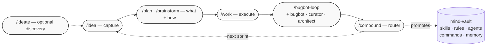

# mind-vault

Cross-host configuration library for AI coding agents — skills, commands, subagent personas, and shared rules, authored once and symlinked into every agent-aware tool.

> **Single source of truth.** You edit in `mind-vault/`; one setup script per host drops symlinks into each tool's native config directory. No copy-paste drift between Cursor, Claude Code, OpenCode, VS Code Copilot, or Antigravity.

## Sprint workflow — the compound loop

Mind-vault's headline value: a five-stage development loop (plus one optional discovery stage) that makes each sprint easier than the last. The final stage, `/compound`, routes every learned lesson back into mind-vault itself — extending skills, rules, and reviewer personas so the next sprint starts with a higher floor.



**Design note on the review stage.** Stages 1–2–3–5 each have a dedicated skill (`/idea`, `/plan`, `/work`, `/compound`). Stage 4 (review) intentionally does not — mind-vault's review subsystem is mature and loop-driven: `AGENT_bugbot` + `AGENT_curator` + `AGENT_architect` personas invoked via `/bugbot-loop`. Adding a wrapper skill would duplicate infrastructure without adding value. The loop IS the stage.

See [docs/SPRINT_WORKFLOW.md](docs/SPRINT_WORKFLOW.md) for the full explainer — authoritative frontmatter schemas, compound-routing table, right-sizing guidance, and the handoff contract between stages.

## Structure

```text
mind-vault/
├── skills/        Agent Skills (SKILL.md + references/ + assets/ + scripts/)
├── agents/        Subagent personas (AGENT_*.md)
├── commands/      Slash commands invoked as /<name>
├── rules/         Shared behavioural rules (RULE_*.md)
├── docs/          Specs, plans, solutions, artefacts
├── scripts/       Per-host symlink setup + shared helpers
└── tools/         Utilities (bugbot helpers, emoji support, etc.)
```

## Skills (11)

Canonical `SKILL.md` patterns with progressive-disclosure `references/`. Each skill has frontmatter `name` + `description` (the probabilistic trigger), stays under ~500 lines, and pushes deep-dive content to `references/`.

### Sprint workflow

| Skill | Purpose |
| --- | --- |
| **ideate** | Stage 0 (optional) — divergent scan + adversarial filter to surface candidate improvements; promotes survivors into IDEA files via the `/idea` schema. |
| **idea** | Stage 1 — create or update atomic `IDEA-NNN-<slug>.md` files in `docs/ideas/`; maintains the per-priority index. Shape from teisutis IDEA-112. |
| **plan** | Stage 2 — turn an IDEA file or rough description into a durable plan; interactive brainstorm bootstrap on thin input; `AGENT_architect` as reviewer. Aliased `/brainstorm`. |
| **work** | Stage 3 — thin orchestrator that reads a plan, enforces `RULE_git-safety` + `RULE_parallel-worktree-docker`, dispatches to implementation personas. |
| **compound** | Stage 5 — **the novel piece.** Routes a post-incident learning through a hybrid Shape-C probe to one of six destinations (project-local, mind-vault skill / rule / agent pass / command, or auto-memory). |
| **ingest-backlog** | Brownfield-takeover helper (one-time). Atomises a monolithic `IDEAS.md` / `BACKLOG.md` / `ROADMAP.md` into per-idea files matching the sprint-workflow schema. Default dry-run. |

### Cross-project engineering

| Skill | Purpose |
| --- | --- |
| **django** | Backend conventions: BaseModel, soft-delete, DRF viewsets, multi-tenancy boundaries, generic-FK pattern, permission probes, translation workflow. |
| **django-frontend** | HTMX + Alpine + Bulma + Crispy Forms — partial dispatch, modal/formset JS contracts, safe query-string generation. Pairs with `django`. |
| **deployment** | Docker Compose production deploys — change-aware scripts, pre/post-migration backups, screen-session remote execution, Let's Encrypt SSL. |
| **surgical-tdd** | Targeted test execution for large Python monoliths (Django runner + pytest nodeids + `--lf` / `-k` / `pytest-xdist` levers). |
| **artefact-retrieval** | Sweep IDE workspaces (Cursor / Antigravity / Claude Code) for plans and analyses; import into `docs/artefacts/`. |

### Meta

| Skill | Purpose |
| --- | --- |
| **skill-writer** | Authoring + refactoring `.md` skills and rules — frontmatter schema, TRIGGER/SKIP, length budget, DO/DON'T matrix, cross-project portability, emitted-template rules. |

## Agents (9 subagent personas)

`AGENT_*.md` files consumed by Cursor's and Claude Code's subagent systems, inlined by OpenCode. Each persona has Prime Directives, an N-pass workflow, and a structured verdict format.

| Persona | Covers | Stage |
| --- | --- | --- |
| **architect** | Structural + abstraction + coupling review; author mode for cross-cutting refactors | Stage 2 reviewer (plan), Stage 3 author (cross-cutting) |
| **backend / frontend / devops / test-engineer** | Implementation personas by domain | Stage 3 dispatch targets from `/work` |
| **bugbot** | Pre-commit rigorous code review (6-pass workflow) | Stage 4 reviewer (invoked via `/bugbot-loop`) |
| **curator** | Pre-commit sister to bugbot + **sprint-end promotion sweep** mode | Stage 4 reviewer + cross-sprint retrospective |
| **documentation** | Docs-only authorship and review | Standalone |
| **researcher** | Ad-hoc investigation / literature review | Standalone |

## Commands (14 slash commands)

**Sprint workflow:** `/ideate`, `/idea`, `/plan` (alias `/brainstorm`), `/work`, `/compound`, `/ingest-backlog`.

**Review + PR flow:** `/bugbot`, `/bugbot_comments`, `/bugbot-loop`, `/create-pr`, `/test`.

**Utility:** `/git-status`, `/load-rules`.

Invoke as `/<command-name>` in any host that supports slash commands. See [docs/SPRINT_WORKFLOW.md](docs/SPRINT_WORKFLOW.md) for the sprint-workflow orchestration story.

## Rules

- **[RULE_git-safety](rules/RULE_git-safety.md)** — HITL gate on `main` and the release branch; feature branches are the agent's sandbox. Governs `/compound`'s branch policy and the bugbot-loop's autonomous-commit permissions.
- **[RULE_i18n-workflow](rules/RULE_i18n-workflow.md)** — Django translation map-first workflow; `.po` files are generated, never hand-edited.
- **[RULE_parallel-worktree-docker](rules/RULE_parallel-worktree-docker.md)** — Worktree + docker-compose isolation contract for parallel work streams. Cited by `/work` when the plan flags parallelism.

## Setup

One setup script per host. All share `_symlink-lib.sh` (DRY helpers) so behaviour is consistent. Scripts safely update existing symlinks and skip non-symlink conflicts.

```bash
# Clone (or set MIND_VAULT=/custom/path before running scripts)
cd ~/projects
git clone git@github.com:infohata/mind-vault.git
cd mind-vault

# Pick your host(s) — run as many as apply:
./scripts/setup-cursor-symlinks.sh         # Cursor 2.4+ (verified through 3.x)
./scripts/setup-claude-code-symlinks.sh    # Claude Code — CLI + IDE extensions + Desktop
./scripts/setup-opencode-symlinks.sh       # OpenCode (XDG default; OPENCODE_HOME override)
./scripts/setup-vscode-copilot-symlinks.sh # VS Code + GitHub Copilot extension
./scripts/setup-antigravity-symlinks.sh    # Google Antigravity (VS Code fork)
```

Hosts don't conflict with each other. Restart the host client after setup for it to rescan.

### OpenCode extra config

Add to `~/.config/opencode/opencode.jsonc` so OpenCode auto-loads rules at session start:

```jsonc
{
  "$schema": "https://opencode.ai/config.json",
  "instructions": ["rules/RULE_*.md"]
}
```

### Antigravity note

Antigravity is a VS Code fork. Its **built-in Gemini chat** has no user-level skills convention, but the **Claude Code and GitHub Copilot extensions** both work inside it:

- Use `setup-claude-code-symlinks.sh` for the Claude Code extension path (reads `~/.claude/`).
- Use `setup-antigravity-symlinks.sh` for the Copilot extension path (forwards to the Copilot script with the right `VSCODE_USER`).

## Authoring

- **New skills**: follow [`docs/SKILL_SPECIFICATION.md`](docs/SKILL_SPECIFICATION.md) (Anthropic Agent Skills reference) and [`skills/skill-writer/SKILL.md`](skills/skill-writer/SKILL.md) (mind-vault enforcement rules, including the emitted-template portability rule).
- **Contributor conventions**: [`AGENTS.md`](AGENTS.md) — naming, structure, file organization, git workflow.

### Markdown hygiene (pre-commit)

Pre-commit hook runs `mdformat` on staged `.md` files. One-time setup:

```bash
pipx install pre-commit          # or: pip install --user pre-commit
pre-commit install               # installs the git hook
pre-commit run --all-files       # optional: one-time full-tree sweep
```

Config: [`.pre-commit-config.yaml`](.pre-commit-config.yaml) pins `mdformat` + `mdformat-gfm` + `mdformat-frontmatter`. [`.mdformat.toml`](.mdformat.toml) preserves consecutive numbering and disables line reflow.

For documentation-heavy repos, prefer `markdownlint-cli2 --fix` over mdformat — it preserves `---` horizontal rules and emphasis style.

## Philosophy

- **Cross-host portable**: content works in Cursor / Claude Code / OpenCode / Copilot / Antigravity — no host-specific tricks in skill bodies.
- **Progressive disclosure**: `SKILL.md` stays under ~500 lines; heavy content lives in `references/` and loads only when invoked.
- **Description = trigger**: the frontmatter `description:` is the probabilistic trigger the host agent reads to decide whether to activate. Noun-dense, specific verbs, names the concrete stack.
- **Generic patterns first, examples second**: concrete project names (e.g. Teisutis) appear only as illustrative fences, never as universal rules.
- **Each unit of engineering work should make the next unit easier** — the compound principle driving the sprint workflow.

## Git workflow

Agents commit freely on feature branches — the PR is the review gate, not each commit. Agents **never** merge or push into `main` or the release branch; that's human-operated through the PR UI.

See [`rules/RULE_git-safety.md`](rules/RULE_git-safety.md) for the full contract including force-push rules and hook-bypass guardrails.

## Version control

Commit all non-sensitive configuration to git.

⚠️ **Never commit**: `.env` files, credentials, API keys, tokens, private keys.
✅ **Do commit**: skills, agent personas, rules, commands, setup scripts, docs.
