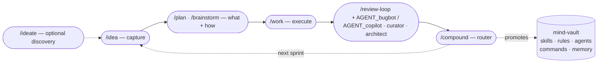

# mind-vault

> ## 👋 New here? Start with [`docs/guides/ONBOARDING.md`](docs/guides/ONBOARDING.md).
>
> Thirty-minute walkthrough from blank machine to first sprint — IDE install, Claude Code CLI + plugins, mind-vault symlinks, productive defaults, your first `/idea → /plan → /work → /review-loop → /wrap → /compound` cycle.
>
> Everything below is **reference material** for engineers already past onboarding.

---

**v4.0.4 — Multi-engine code review · Open-source release (Windows-host adopter bootstrap + `make release` helper + expanded ONBOARDING + `docs/guides/` subdirectory).**

Cross-host configuration library for AI coding agents — skills, commands, subagent personas, and shared rules, authored once and symlinked into every agent-aware tool.

> **Single source of truth.** You edit in `mind-vault/`; one setup script per host drops symlinks into each tool's native config directory. No copy-paste drift between Cursor, Claude Code, OpenCode, VS Code Copilot, or Antigravity.
>
> **v4 highlights.** The Stage 4 review surface is now engine-agnostic — opt into Cursor Bugbot, GitHub Copilot, both concurrently, or neither (curator-only fallback). Canonical entry: `/review-loop <PR> bugbot`, `/review-loop <PR> copilot`, or `/review-loop <PR> bugbot,copilot`.
>
> **Deprecation (v4.2, upcoming).** `/bugbot-loop` and `/copilot-loop` are deprecated thin wrappers and will be removed in a future release. Prefer `/review-loop <PR> <engine>` directly — same behaviour, one fewer command surface to load, further trimming the always-on token cost.

## Sprint workflow — the compound loop

Mind-vault's headline value: a five-stage development loop (plus one optional discovery stage) that makes each sprint easier than the last. The final stage, `/compound`, routes every learned lesson back into mind-vault itself — extending skills, rules, and reviewer personas so the next sprint starts with a higher floor.



**Design note on the review stage.** Stages 1–2–3–5 each have a dedicated skill (`/idea`, `/plan`, `/work`, `/compound`). Stage 4 (review) is engine-selectable via the unified `/review-loop` skill: pass `bugbot`, `copilot`, or `bugbot,copilot` as the engine argument. Both engines share the same Phase 1–4 orchestrator backed by `AGENT_bugbot` / `AGENT_copilot` / `AGENT_curator` / `AGENT_architect` personas; engine-specific details (clean-signal parsing, retrigger semantics, Tier 1 catalogue) live in per-engine adapter references. The legacy `/bugbot-loop` and `/copilot-loop` thin wrappers are deprecated as of v4.2 (upcoming).

See [docs/guides/SPRINT_WORKFLOW.md](docs/guides/SPRINT_WORKFLOW.md) for the full explainer — authoritative frontmatter schemas, compound-routing table, right-sizing guidance, and the handoff contract between stages.

## Structure

```text
mind-vault/
├── skills/        Agent Skills (SKILL.md + references/ + assets/ + scripts/)
├── agents/        Subagent personas (AGENT_*.md)
├── commands/      Slash commands invoked as /<name>
├── rules/         Always-on behavioural rules (RULE_*.md — auto-loaded every session)
├── docs/          Specs, plans, solutions, artefacts
├── scripts/       Per-host symlink setup + OS bootstrap helpers (e.g. install-wsl.ps1)
└── tools/         Utilities (review-loop helpers, emoji support, etc.)
```

## Skills (15)

Canonical `SKILL.md` patterns with progressive-disclosure `references/`. Each skill has frontmatter `name` + `description` (the probabilistic trigger), stays under ~500 lines, and pushes deep-dive content to `references/`.

### Sprint workflow

| Skill | Purpose |
| --- | --- |
| **ideate** | Stage 0 (optional) — divergent scan + adversarial filter to surface candidate improvements; promotes survivors into IDEA files via the `/idea` schema. |
| **idea** | Stage 1 — create or update atomic `IDEA-NNN-<slug>.md` files in `docs/ideas/`; maintains the per-priority index. Shape from teisutis IDEA-112. |
| **plan** | Stage 2 — turn an IDEA file or rough description into a durable plan; interactive brainstorm bootstrap on thin input; `AGENT_architect` as reviewer. Aliased `/brainstorm`. |
| **work** | Stage 3 — thin orchestrator that reads a plan, enforces `RULE_git-safety` + the parallel-worktree-docker discipline (loaded from `skills/sprint-auto/references/`), dispatches to implementation personas. |
| **wrap** | Stage 4.5 — post-merge documentation + cleanup sweep. Flips IDEA frontmatter to `complete`, re-sorts the ideas index, appends a devlog entry, tears down the worktree stack (if one was in use), scans project docs for stale references. Sits between a merged PR and `/compound`. |
| **compound** | Stage 5 — **the novel piece.** Routes a post-incident learning through a hybrid Shape-C probe to one of six destinations (project-local, mind-vault skill / rule / agent pass / command, or auto-memory). |
| **ingest-backlog** | Brownfield-takeover helper (one-time). Atomises a monolithic `IDEAS.md` / `BACKLOG.md` / `ROADMAP.md` into per-idea files matching the sprint-workflow schema. Default dry-run. |
| **sprint-auto** | Overnight unattended wrapper around the **full sprint workflow** (stages 2–5). Per IDEA: `/plan → /work → /review-loop (deliverables) → /wrap (pre-merge) → /review-loop (docs) → teardown` in per-IDEA git worktrees with independent docker-compose stacks; `/review-loop` invocation expands to `bugbot`, `copilot`, or `bugbot,copilot` per project config (`SPRINT_AUTO_REVIEW_ENGINE`). Per-pass escalation caps 20/5/5 (deliverables/docs/mind-vault compound), rollback-able fresh commits. Batch end: `/compound` per candidate + `/review-loop` on each mind-vault PR produced. Belt-and-suspenders gates (`auto_safe: true` frontmatter + explicit arg allowlist); stops at the HITL merge boundary per `RULE_git-safety`. |

### Cross-project engineering

| Skill | Purpose |
| --- | --- |
| **django** | Backend conventions: BaseModel, soft-delete, DRF viewsets, multi-tenancy boundaries, generic-FK pattern, permission probes, translation workflow. |
| **django-frontend** | HTMX + Alpine + Bulma + Crispy Forms — partial dispatch, modal/formset JS contracts, safe query-string generation. Pairs with `django`. |
| **deployment** | Docker Compose production deploys — change-aware scripts, pre/post-migration backups, screen-session remote execution, Let's Encrypt SSL. |
| **surgical-tdd** | Targeted test execution for large Python monoliths (Django runner + pytest nodeids + `--lf` / `-k` / `pytest-xdist` levers). |
| **artefact-retrieval** | Sweep IDE workspaces (Cursor / Antigravity / Claude Code) for plans and analyses; import into `docs/artefacts/`. |
| **dependabot-triage** | Multi-ecosystem Dependabot PR triage — content-based dup detection across pip workspaces, risk-tier batching with per-dep commits (preserves `git bisect` post-squash-merge), live-staging smoke for SDK bumps. |

### Meta

| Skill | Purpose |
| --- | --- |
| **skill-writer** | Authoring + refactoring `.md` skills and rules — frontmatter schema, TRIGGER/SKIP, length budget, DO/DON'T matrix, cross-project portability, emitted-template rules. |

## Agents (9 subagent personas)

`AGENT_*.md` files consumed by Cursor's and Claude Code's subagent systems, inlined by OpenCode. Each persona has Prime Directives, an N-pass workflow, and a structured verdict format.

| Persona | Covers | Stage |
| --- | --- | --- |
| **architect** | Structural + abstraction + coupling review; author mode for cross-cutting refactors | Stage 2 reviewer (plan), Stage 3 author (cross-cutting) |
| **backend / frontend / devops / test-engineer** | Implementation personas by domain | Stage 3 dispatch targets from `/work` |
| **bugbot / copilot** | Pre-commit rigorous code review (6-pass workflow); engine-specific personas with identical pattern catalogue | Stage 4 reviewer (invoked via `/review-loop <PR> <engine>`) |
| **curator** | Pre-commit sister to the review bots + **sprint-end promotion sweep** mode | Stage 4 reviewer + cross-sprint retrospective |
| **documentation** | Docs-only authorship and review | Standalone |
| **researcher** | Ad-hoc investigation / literature review | Standalone |

## Commands

Slash commands surface from two sources via the host's symlink: `commands/` (7 review/PR/utility entries) and `skills/` (every skill with a `name:` frontmatter is invocable as `/<name>` per the skill-writer convention). The two groups below list the **sprint-workflow** + **automation** + **review/PR** entries — the most common surfaces. Engineering-pattern skills (`django`, `django-frontend`, `deployment`, `surgical-tdd`, `dependabot-triage`, `mobile-ux-polish`, `skill-writer`, `artefact-retrieval`) are also slash-invocable but typically activate via trigger-phrase rather than direct slash; see each skill's frontmatter.

**Sprint workflow:** `/ideate`, `/idea`, `/plan` (alias `/brainstorm`), `/work`, `/wrap`, `/compound`, `/ingest-backlog`.

**Automation:** `/sprint-auto` — overnight unattended orchestrator that chains the full sprint workflow (stages 2–5: `/plan → /work → /review-loop → /wrap (pre-merge) → /review-loop → teardown → /compound → /review-loop`) for curated IDEAs; the `/review-loop` invocation expands to `bugbot`, `copilot`, or `bugbot,copilot` per project config (`SPRINT_AUTO_REVIEW_ENGINE`). See [`skills/sprint-auto/SKILL.md`](skills/sprint-auto/SKILL.md).

**Review + PR flow:** `/review-loop` (canonical entry for all engine combinations — `bugbot`, `copilot`, or `bugbot,copilot`), `/create-pr`, `/test`. See `docs/guides/ONBOARDING.md` § "Pick a code-review engine" for the three-way choice (bugbot / copilot / curator-only); use `/review-loop <PR> bugbot,copilot` when both engines are enabled to get cycle-level synchronisation. `/bugbot-loop` and `/copilot-loop` still work as deprecated thin wrappers but will be removed; prefer `/review-loop <PR> <engine>` directly.

**Utility:** `/git-status`, `/load-rules`.

Invoke as `/<command-name>` in any host that supports slash commands. See [docs/guides/SPRINT_WORKFLOW.md](docs/guides/SPRINT_WORKFLOW.md) for the sprint-workflow orchestration story.

## Rules (always-on)

The four rules under `rules/` are auto-loaded into every session via `~/.claude/rules` symlink. They cover guardrails that apply broadly across stages — not domain-specific patterns. Domain-specific patterns that used to be rules now live as **skill references** that load on-demand when the relevant skill activates (see § Skill references below).

- **[RULE_git-safety](rules/RULE_git-safety.md)** — HITL gate on `main` and the release branch; feature branches are the agent's sandbox. Governs `/compound`'s branch policy and the review-loop's autonomous-commit permissions.
- **[RULE_self-sweep-before-push](rules/RULE_self-sweep-before-push.md)** — Pyflakes touched-files sweep + Contract-Change Sweep (grep ALL callers when a shared helper's signature/return type changes) between the review-loop's Phase 2 and Phase 3. Saves 5-10 min of review-cycle wall-time per trivial dead-import / unused-local / missed-caller finding.
- **[RULE_rename-before-drop](rules/RULE_rename-before-drop.md)** — Refactor commit-sequence discipline: rename references first, full test pass, then drop the legacy symbol, re-test for regressions. Per-commit compilability + bisectability; missed references surface during the rename-only test pass instead of hiding inside post-drop noise.
- **[RULE_cross-idea-amendments](rules/RULE_cross-idea-amendments.md)** — Shipped IDEAs are not stones — amend freely as conditions change, with bidirectional documentation between the amending and amended IDEAs. Fires at any workflow stage when downstream work needs to modify an upstream IDEA's files.

## Skill references (load on demand)

Domain-specific patterns that used to live in `rules/`. Each is loaded by its owning skill at the moment it's relevant — keeps always-on context lean.

- **[I18N_WORKFLOW](skills/django/references/I18N_WORKFLOW.md)** *(was RULE_i18n-workflow)* — Django translation map-first workflow; `.po` files are generated, never hand-edited. Per-app sharded-map ownership rule. **Loaded by:** `/work` when touching translations, `skills/django` + `skills/django-frontend`.
- **[IDEAS_LOCATION_STATUS](skills/idea/references/IDEAS_LOCATION_STATUS.md)** *(was RULE_ideas-location-status)* — IDEA files live in exactly two places: `docs/ideas/` while in backlog, `docs/archive/YYYY-MM-idea-NNN-<slug>/` thereafter. Single `git mv` at `/plan` time; all subsequent status transitions are frontmatter-only. **Loaded by:** `/idea`, `/plan`, `/work`, `/wrap`, `/compound`, `/ingest-backlog`.
- **[PARALLEL_WORKTREE_DOCKER](skills/sprint-auto/references/PARALLEL_WORKTREE_DOCKER.md)** *(was RULE_parallel-worktree-docker)* — Worktree + docker-compose isolation contract for parallel work streams (port offsets, subnet remap, MinIO bucket re-init, env-var sentinel-rewrite). **Loaded by:** `/work` (parallel plans), `/sprint-auto` (per-IDEA worktree bootstrap). Reachable from `/deployment` via its `CONTAINER_DNS_NSS.md` and `SHELL_INSTALLERS.md` references (privileged-fileops escape hatch).
- **[TENANT_SCOPED_FK_VALIDATION](skills/django/references/TENANT_SCOPED_FK_VALIDATION.md)** *(was RULE_tenant-scoped-fk-validation)* — Validate-and-prune FK helpers must scope existence checks explicitly when a model carries `org_id` (or equivalent tenant column). Schema routing alone is insufficient for shared/public-schema tables. **Loaded by:** multi-tenant Django work via `skills/django`.
- **[VISUAL_BASELINE_BUMPS](skills/django-frontend/references/VISUAL_BASELINE_BUMPS.md)** *(was RULE_visual-baseline-bumps)* — AI agents NEVER auto-`--update-snapshots`; baseline regen requires explicit human invocation. **Loaded by:** `skills/django-frontend` (Playwright work), `skills/sprint-auto` (Direction-1 IDEAs).
- **[WATCHER_HYGIENE](skills/work/references/WATCHER_HYGIENE.md)** *(was RULE_orchestrator-trash-collection)* — Explicit-stop discipline for `run_in_background` watchers (test runs, log tails, polling loops); no wall-clock timeouts; `pgrep -f` self-match avoidance. **Loaded by:** `/work`, `/sprint-auto`, `/review-loop`.

## Setup

One setup script per host. All share `_symlink-lib.sh` (DRY helpers) so behaviour is consistent. Scripts safely update existing symlinks and skip non-symlink conflicts.

```bash
# Clone (or set MIND_VAULT=/custom/path before running scripts)
cd ~/projects
git clone git@github.com:infohata/mind-vault.git
cd mind-vault

# Pick your host(s) — run as many as apply:
./scripts/setup-cursor-symlinks.sh         # Cursor 2.4+ (verified through 3.x)
./scripts/setup-claude-code-symlinks.sh    # Claude Code — CLI + IDE extensions + Desktop
./scripts/setup-opencode-symlinks.sh       # OpenCode (XDG default; OPENCODE_HOME override)
./scripts/setup-vscode-copilot-symlinks.sh # VS Code + GitHub Copilot extension
./scripts/setup-antigravity-symlinks.sh    # Google Antigravity (VS Code fork)
```

Hosts don't conflict with each other. Restart the host client after setup for it to rescan.

### OpenCode extra config

Add to `~/.config/opencode/opencode.jsonc` so OpenCode auto-loads rules at session start:

```jsonc
{
  "$schema": "https://opencode.ai/config.json",
  "instructions": ["rules/RULE_*.md"]
}
```

### Antigravity note

Antigravity is a VS Code fork. Its **built-in Gemini chat** has no user-level skills convention, but the **Claude Code and GitHub Copilot extensions** both work inside it:

- Use `setup-claude-code-symlinks.sh` for the Claude Code extension path (reads `~/.claude/`).
- Use `setup-antigravity-symlinks.sh` for the Copilot extension path (forwards to the Copilot script with the right `VSCODE_USER`).

## Authoring

- **New skills**: follow [`docs/guides/SKILL_SPECIFICATION.md`](docs/guides/SKILL_SPECIFICATION.md) (Anthropic Agent Skills reference) and [`skills/skill-writer/SKILL.md`](skills/skill-writer/SKILL.md) (mind-vault enforcement rules, including the emitted-template portability rule).
- **Contributor conventions**: [`AGENTS.md`](AGENTS.md) — naming, structure, file organization, git workflow.

### Markdown hygiene (pre-commit)

Pre-commit hook runs `mdformat` on staged `.md` files. One-time setup:

```bash
pipx install pre-commit          # or: pip install --user pre-commit
pre-commit install               # installs the git hook
pre-commit run --all-files       # optional: one-time full-tree sweep
```

Config: [`.pre-commit-config.yaml`](.pre-commit-config.yaml) pins `mdformat` + `mdformat-gfm` + `mdformat-frontmatter`. [`.mdformat.toml`](.mdformat.toml) preserves consecutive numbering and disables line reflow.

For documentation-heavy repos, prefer `markdownlint-cli2 --fix` over mdformat — it preserves `---` horizontal rules and emphasis style.

## Philosophy

- **Cross-host portable**: content works in Cursor / Claude Code / OpenCode / Copilot / Antigravity — no host-specific tricks in skill bodies.
- **Progressive disclosure**: `SKILL.md` stays under ~500 lines; heavy content lives in `references/` and loads only when invoked.
- **Description = trigger**: the frontmatter `description:` is the probabilistic trigger the host agent reads to decide whether to activate. Noun-dense, specific verbs, names the concrete stack.
- **Generic patterns first, examples second**: concrete project names (e.g. Teisutis) appear only as illustrative fences, never as universal rules.
- **Each unit of engineering work should make the next unit easier** — the compound principle driving the sprint workflow.

## Git workflow

Agents commit freely on feature branches — the PR is the review gate, not each commit. Agents **never** merge or push into `main` or the release branch; that's human-operated through the PR UI.

See [`rules/RULE_git-safety.md`](rules/RULE_git-safety.md) for the full contract including force-push rules and hook-bypass guardrails.

## Version control

Commit all non-sensitive configuration to git.

⚠️ **Never commit**: `.env` files, credentials, API keys, tokens, private keys.
✅ **Do commit**: skills, agent personas, rules, commands, setup scripts, docs.

## License

Licensed under the [Apache License, Version 2.0](LICENSE). Copyright 2026 Kestutis Januskevicius.
