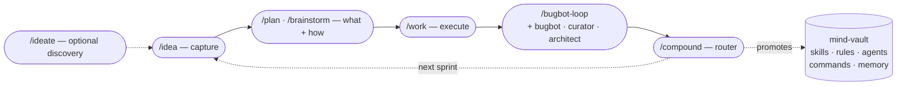

# Sprint Workflow

Mind-vault's five-stage development loop, inspired by Every Inc's compound-engineering plugin but deliberately tuned for a single-user, cross-project knowledge store.



Each run of the loop produces durable artifacts in the target project's `docs/` tree. The loop compounds because the final stage — `/compound` — routes learnings back into mind-vault when they generalise, extending skills, rules, and reviewer personas every project thereafter will pick up.

The optional `/ideate` stage sits above `/idea` — use it between sprints to discover candidate improvements via divergent scan + adversarial filter, then promote the survivors into IDEA files (it uses the same schema as `/idea`).

## Philosophy

- **Each unit of engineering work should make the next unit easier.** Traditional development accumulates debt; the compound loop inverts it.
- **Stage skipping is a first-class affordance.** Trivial fixes bypass `/idea` and `/plan` entirely. The loop is a pipeline, not a bureaucracy.
- **Artifacts live in the target project.** Mind-vault is the library; projects are the journal. Mind-vault grows only when `/compound` explicitly promotes a cross-cutting pattern.
- **Review stage is unchanged.** `/bugbot-loop` + the existing review personas stay as-is. What's new is `/compound` reading bugbot's findings file as an input source and routing each cleared finding.

## The five stages (plus optional discovery)

| Stage | Command | Input | Output |
| --- | --- | --- | --- |
| 0. Ideate (optional) | `/ideate` | Scoped area (project / app / layer) | Menu of ranked candidates; selected survivors promoted into `IDEA-NNN-<slug>.md` files |
| 1. Idea | `/idea [slug]` | Title (new) or slug (update) | `<project>/docs/ideas/IDEA-NNN-<slug>.md` |
| 2. Brainstorm / Plan | `/plan` or `/brainstorm` | IDEA file, or raw description | `<project>/docs/archive/YYYY-MM-idea-NNN-<slug>/YYYY-MM-DD-<slug>-plan.md` (co-located with the moved IDEA file per `RULE_ideas-location-status`) |
| 3. Work | `/work` | Plan file | Code changes on a feature branch |
| 4. Review | `/bugbot-loop` | Open PR | Cleared bugbot findings + loop output file |
| 4.5. Wrap | `/wrap` | Merged PR | IDEA frontmatter `complete` + re-sorted index + devlog entry + worktree stack torn down + docs patched for renamed / added identifiers |
| 5. Compound | `/compound` | Solved problem, or bugbot output file | Solution doc OR mind-vault skill/rule/agent/command/memory update |

**Brainstorm folds into plan.** `/brainstorm` is an alias for `/plan`. When the IDEA file is thin or the description is under-specified, the plan skill interactively explores requirements (the brainstorm front-end) before emitting the plan artifact.

## Overnight unattended mode — `/sprint-auto`

`/sprint-auto` is an optional wrapper around stages 2–3 (`/plan → /work → PR`) for unattended overnight execution on a VPS. It takes a curated list of IDEAs the human has pre-cleared and runs each one in its own git worktree + docker-compose project, stopping at the HITL merge boundary per `RULE_git-safety`.

Opt-in is belt-and-suspenders: every IDEA needs `auto_safe: true` + `auto_safe_reason` in frontmatter **and** explicit presence in the invocation args. Never scan-mode. `priority: high` IDEAs and those touching sensitive paths (`.env*`, base `docker-compose.yml`, CI workflows, destructive migrations, auth middleware) require additional explicit overrides. See `skills/sprint-auto/references/safety-gates.md` for the full gate list.

Worktrees are preserved after each run — success or failure — so the human can review PRs or diagnose failures in the morning. The skill never merges, never force-pushes, never teardown worktrees; those are human decisions. See `skills/sprint-auto/SKILL.md` for the full pattern and `references/worktree-lifecycle.md` for the project-local bootstrap-script contract (`tools/sprint-auto-bootstrap.sh`).

## Compound routing (the novel piece)

When you've just solved a problem — or a bugbot-loop finding has been cleared — `/compound` classifies the learning through a hybrid narrative-probe + taxonomy-quiz and writes it to the right destination:

| Shape of learning | Destination | Example |
| --- | --- | --- |
| Project-specific fix with domain detail | `<project>/docs/solutions/<topic>.md` | Webhook HMAC mismatch due to flat-payload edge case |
| Cross-project pattern | mind-vault skill or `references/` file | "Async tenant context loss in Channels → wrap in `with tenant_context(tenant):`" |
| Guardrail-worthy hard rule | `mind-vault/rules/RULE_<name>.md` | "Never hand-edit `.po` files" |
| Reviewer-caught pattern | new pass appended to `agents/AGENT_<persona>.md` | "Dictionary key collisions silently swallow overrides" |
| Tool-worthy repeatable action | `mind-vault/commands/<verb>.md` or `tools/<script>.sh` | Regex sweep for `format_html(_(...))` migration drift |
| User-behavioural preference | auto-memory `feedback_*` / `project_*` / `user_*` / `reference_*` | "Prefer bundled PR over split for this kind of refactor" |

Mind-vault destinations land as commits on the active sprint branch (no new branch if one is in flight — no branch spam), with an open PR maintained by `/compound` itself. If mind-vault is on `main`, the skill creates a fresh `compound/YYYY-MM-DD-<slug>` branch first. `RULE_git-safety` is honoured: the agent never commits to `main`, never force-merges; the human merges the PR.

## Authoritative schemas

These are the canonical frontmatter shapes. Phase 1.5 `/ingest-backlog` and Phase 2 `/ideate` both read this section as the source of truth.

### IDEA file frontmatter

```yaml
---
id: 112
title: Split IDEAS.md into per-idea files
status: idea          # idea | in-progress | complete | superseded
priority: medium      # high | medium | low
supersedes: []        # list of IDEA ids this replaces
superseded_by: null   # scalar id of the replacement, or null
depends_on: []        # list of IDEA ids required before starting
related: []           # list of IDEA ids that share context
created: 2026-04-14   # YYYY-MM-DD
completed: null       # YYYY-MM-DD or null
---

# IDEA-112: Split IDEAS.md into per-idea files

**Problem**: <short paragraph>

**Proposal**: <short paragraph or bullets>

**Why now** / **Non-goals** / **Related** — free-form prose follows.
```

Shape lifted from teisutis IDEA-112 — deliberately small so it maps 1:1 onto a future structured data model without field-name drift.

### Plan and solution frontmatter (stage handoff)

```yaml
---
stage: plan | solution
slug: short-kebab-slug
created: 2026-04-19   # YYYY-MM-DD
source: <path-to-IDEA-file or null>
status: draft | ready | shipped
project: <project-name>
---
```

The `source` field is what makes handoff possible: `/plan` reads an IDEA file and sets `source:` to its path; `/compound` reads a plan or bugbot output and traces back through `source:` chains when documenting the learning.

## Directory layout inside a target project

Per [`RULE_ideas-location-status`](../rules/RULE_ideas-location-status.md), an IDEA file lives in exactly one of two locations across its whole life — `docs/ideas/` while in backlog, `docs/archive/YYYY-MM-idea-NNN-<slug>/` everything after. The only filesystem move is `idea → archive` at `/plan` time (or `/work` time for small-scope plans that bypassed `/plan`). Post-move, status flips are frontmatter-only.

```text
<project>/
└── docs/
    ├── ideas/
    │   ├── README.md                            # single index, grouped by priority
    │   ├── IDEA-088-<backlog-slug>.md           # status: idea
    │   ├── IDEA-112-<backlog-slug>.md           # status: idea
    │   └── ...
    ├── archive/
    │   ├── 2026-04-idea-042-<slug>/             # in-progress / complete / superseded / rejected
    │   │   ├── IDEA-042-<slug>.md               # moved here at /plan time; status flips via frontmatter
    │   │   ├── 2026-04-19-<slug>-plan.md        # plan co-located with the IDEA it implements
    │   │   ├── research-*.md                    # investigation notes
    │   │   ├── session-notes/                   # agent session prompts
    │   │   └── README.md                        # completion summary (added on merge)
    │   ├── 2026-04-idea-109-<slug>/             # superseded idea — same shape, fewer artefacts
    │   │   └── IDEA-109-<slug>.md               # status: superseded
    │   └── 2026-04-DEVELOPMENT_LOG.md           # monthly chronological engineering log
    └── solutions/
        ├── async-tenant-context.md              # project-local compound destinations
        └── webhook-hmac-edge-cases.md
```

- `docs/ideas/README.md` is the single index for all statuses. Entries link out to `../archive/<dir>/` when the IDEA has left backlog. Completed ideas appear as footer lines under "References — Implemented".
- The archive directory's name (`YYYY-MM-idea-NNN-<slug>/`) is stamped at move-time and never changes — neither completion nor rejection renames it. Stable reference path for the idea's whole life.
- `DEVELOPMENT_LOG.md` follows a per-month file convention under `docs/archive/` (one file per calendar month).
- Solutions use dated or topic slugs so they sort and never collide.

## Running the loop

Typical invocation on a new feature:

```bash
/idea                      # creates IDEA-NNN-<slug>.md interactively
/plan <slug>               # or /brainstorm <slug> — produces plan doc
/work <plan-path>          # dispatches to personas, commits as it goes
# ... open PR ...
/bugbot-loop <pr-url>      # clears findings
/compound                  # routes what we learned
```

Stage skipping on a trivial fix:

```bash
# no /idea, no /plan — just go
git checkout -b fix/typo
# ... fix ...
# open PR, /bugbot-loop clears it, maybe /compound if you learned something
```

## Right-sizing

| Work shape | Minimum ceremony |
| --- | --- |
| Typo / one-liner | skip idea + plan; do work + review |
| Small bounded fix (< 30 min) | skip idea; plan is optional |
| Feature with unknowns | full loop from idea |
| Cross-cutting refactor | full loop; compound at end is non-optional |
| Post-incident learning | stages 1–3 already done elsewhere; invoke `/compound` directly |

The loop's value scales with the work's ambiguity. Don't force ceremony onto work that doesn't need it.

## References

- [skills/ideate/](../skills/ideate/SKILL.md) — optional discovery stage above `/idea`
- [skills/idea/](../skills/idea/SKILL.md) — atomic IDEA file creator / updater
- [skills/plan/](../skills/plan/SKILL.md) — merged brainstorm + plan skill
- [skills/work/](../skills/work/SKILL.md) — thin dispatch orchestrator
- [skills/compound/](../skills/compound/SKILL.md) — the router
- [skills/ingest-backlog/](../skills/ingest-backlog/SKILL.md) — brownfield-takeover helper (Phase 1.5)
- [agents/AGENT_curator.md](../agents/AGENT_curator.md) — secondary "sprint-end promotion sweep" mode scans `docs/solutions/` for recurring patterns and proposes `/compound` invocations
- [rules/RULE_git-safety.md](../rules/RULE_git-safety.md) — what `/compound` honours when promoting to mind-vault
- [rules/RULE_parallel-worktree-docker.md](../rules/RULE_parallel-worktree-docker.md) — what `/work` cites for parallel execution

---

**Last Updated**: 2026-04-20 (stage-2 output path + directory-layout diagram synced with `RULE_ideas-location-status` two-location model)
